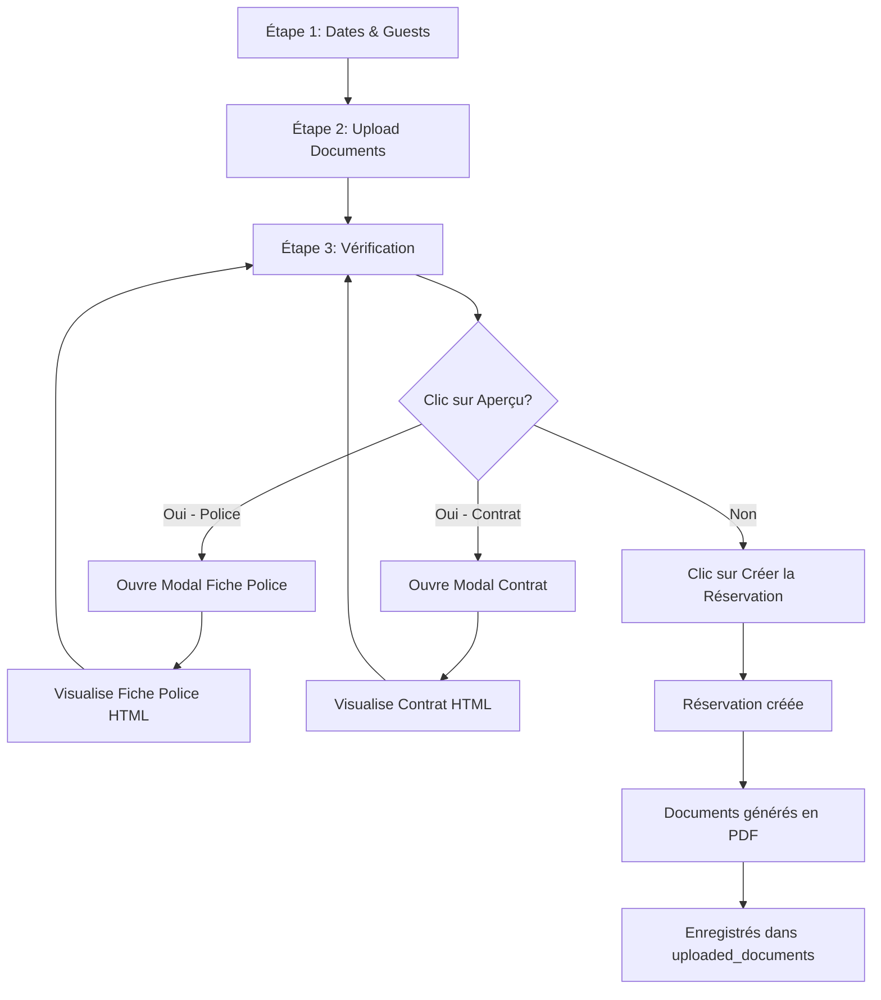

# 👁️ Ajout Aperçu Documents dans BookingWizard

## Date : 24 Novembre 2025

---

## 🎯 Objectif

Permettre à l'utilisateur de **visualiser un aperçu** de la fiche de police et du contrat **AVANT** de créer la réservation, directement depuis l'étape "Vérification et finalisation" du `BookingWizard`.

---

## ✨ Fonctionnalités Ajoutées

### 1. **Boutons "Aperçu"** dans ReviewStep

Au lieu de simples badges "PDF", nous avons maintenant des boutons interactifs :

- 🔵 **Bouton "Aperçu" pour la Fiche de Police**
  - Design : Bordure bleue avec hover bleu
  - Action : Ouvre un modal avec l'aperçu HTML de la fiche de police
  - État désactivé si aucun client enregistré

- 🟢 **Bouton "Aperçu" pour le Contrat**
  - Design : Bordure verte avec hover vert
  - Action : Ouvre un modal avec l'aperçu HTML du contrat
  - État désactivé si aucun client enregistré

### 2. **Composant DocumentPreviewDialog**

Nouveau composant réutilisable qui affiche un aperçu HTML des documents :

#### Aperçu Fiche de Police
- ✅ En-tête "ROYAUME DU MAROC - FICHE DE POLICE"
- ✅ Une fiche par client avec toutes les informations :
  - Nom complet
  - Nationalité
  - Date et lieu de naissance
  - Type et numéro de document
  - Dates d'arrivée et de départ
  - Adresse de l'établissement
- ✅ Design conforme au format officiel marocain

#### Aperçu Contrat de Location
- ✅ En-tête "CONTRAT DE LOCATION MEUBLÉE DE COURTE DURÉE"
- ✅ Sections complètes :
  - Identification du bailleur
  - Identification du locataire (avec informations du premier guest)
  - Articles du contrat (objet, durée, occupants, obligations, résiliation)
  - Espaces pour signatures du bailleur et du locataire
- ✅ Design professionnel avec police serif (Times New Roman)

---

## 📋 Fichiers Modifiés

### 1. `src/components/wizard/ReviewStep.tsx`

#### Avant :
```tsx
<Badge variant="outline">
  <Download className="w-3 h-3 mr-1" />
  PDF
</Badge>
```

#### Après :
```tsx
<div className="flex gap-2">
  <Button
    variant="outline"
    size="sm"
    onClick={() => handlePreviewDocument('police')}
    disabled={formData.guests.length === 0}
    className="border-blue-200 hover:border-blue-300 hover:bg-blue-50"
  >
    <Eye className="w-4 h-4 mr-2" />
    Aperçu
  </Button>
  <Badge variant="outline" className="bg-white">
    <Download className="w-3 h-3 mr-1" />
    PDF
  </Badge>
</div>
```

**Changements clés** :
- ✅ Import de `Eye`, `Loader2` depuis lucide-react
- ✅ Import de `DocumentPreviewDialog`
- ✅ État `previewDocument` pour gérer l'ouverture du modal
- ✅ Fonction `handlePreviewDocument` avec validation des données
- ✅ Rendu conditionnel du `DocumentPreviewDialog`
- ✅ Design amélioré avec gradients et couleurs thématiques

### 2. `src/components/wizard/DocumentPreviewDialog.tsx` (NOUVEAU)

Composant Dialog avec :
- ✅ Props : `isOpen`, `onClose`, `documentType`, `formData`
- ✅ Fonctions de formatage de dates
- ✅ Fonction `renderPolicePreview()` : Génère HTML fiche de police
- ✅ Fonction `renderContractPreview()` : Génère HTML contrat
- ✅ Layout responsive avec scroll
- ✅ Message d'avertissement : "Aperçu uniquement - Le document final sera généré en PDF"

---

## 🎨 Design

### Section "Documents à générer"

```
┌─────────────────────────────────────────────────────┐
│ 📄 Documents à générer                              │
├─────────────────────────────────────────────────────┤
│ ┌─────────────────────────────────────────────────┐ │
│ │ 🔵 Fiches d'arrivée (Police)      [Aperçu] [PDF]│ │
│ │ 1 fiche(s) - Une par client                     │ │
│ └─────────────────────────────────────────────────┘ │
│ ┌─────────────────────────────────────────────────┐ │
│ │ 🟢 Contrat de location            [Aperçu] [PDF]│ │
│ │ Contrat standard pour location meublée          │ │
│ └─────────────────────────────────────────────────┘ │
└─────────────────────────────────────────────────────┘
```

### Modal Aperçu

```
┌─────────────────────────────────────────────────────┐
│ Aperçu - Fiche de Police                       [X]  │
├─────────────────────────────────────────────────────┤
│ ┌─────────────────────────────────────────────────┐ │
│ │         ROYAUME DU MAROC                        │ │
│ │         FICHE DE POLICE                         │ │
│ │ Déclaration d'Arrivée dans un Établissement... │ │
│ │                                                 │ │
│ │ ┌─────────────────────────────────────────────┐ │ │
│ │ │ CLIENT 1                                    │ │ │
│ │ ├─────────────────────────────────────────────┤ │ │
│ │ │ NOM ET PRÉNOM(S) : MARCEL YVES GUY PICARD  │ │ │
│ │ │ NATIONALITÉ : FRANÇAIS                      │ │ │
│ │ │ ...                                         │ │ │
│ │ └─────────────────────────────────────────────┘ │ │
│ └─────────────────────────────────────────────────┘ │
├─────────────────────────────────────────────────────┤
│ ⚠️ Aperçu uniquement - Le document final sera      │
│ généré en PDF après la création de la réservation  │
│                                          [Fermer]   │
└─────────────────────────────────────────────────────┘
```

---

## 🔄 Flux Utilisateur



---

## ✅ Validation

### Conditions pour activer "Aperçu"
- ✅ Au moins 1 client enregistré (`formData.guests.length > 0`)
- ✅ Date d'arrivée renseignée (`formData.checkInDate`)
- ✅ Date de départ renseignée (`formData.checkOutDate`)

### Si conditions non remplies
- ❌ Bouton "Aperçu" désactivé (grisé)
- ⚠️ Toast : "Veuillez renseigner les dates et ajouter au moins un client pour prévisualiser les documents."

---

## 🧪 Tests

### Test 1 : Aperçu Fiche de Police
1. Ouvrir `BookingWizard`
2. Renseigner dates
3. Ajouter un client (via upload ou manuellement)
4. Aller à l'étape "Vérification"
5. Cliquer sur "Aperçu" (Fiche de Police)
6. ✅ **Attendu** : Modal s'ouvre avec aperçu HTML de la fiche
7. Vérifier les informations affichées (nom, nationalité, dates, etc.)
8. Fermer le modal

### Test 2 : Aperçu Contrat
1. Dans la même réservation
2. Cliquer sur "Aperçu" (Contrat de location)
3. ✅ **Attendu** : Modal s'ouvre avec aperçu HTML du contrat
4. Vérifier :
   - Informations du bailleur
   - Informations du locataire (premier guest)
   - Articles du contrat
   - Durée : X nuit(s)
   - Dates formatées correctement
5. Fermer le modal

### Test 3 : État désactivé
1. Créer une nouvelle réservation
2. Renseigner uniquement les dates
3. Aller à l'étape "Vérification" (sans ajouter de client)
4. ✅ **Attendu** : Boutons "Aperçu" grisés et non cliquables

### Test 4 : Plusieurs clients
1. Ajouter 3 clients
2. Cliquer sur "Aperçu" (Fiche de Police)
3. ✅ **Attendu** : 3 fiches individuelles affichées dans le modal
4. Cliquer sur "Aperçu" (Contrat)
5. ✅ **Attendu** : Contrat avec le premier guest + mention "Accompagné de 2 autres personnes"

---

## 🎯 Avantages

1. **✅ Validation visuelle** : L'utilisateur peut vérifier les informations avant création
2. **✅ Pas d'attente** : Aperçu instantané sans appel API
3. **✅ UX améliorée** : Interaction claire et moderne
4. **✅ Réduction d'erreurs** : Détection précoce de données manquantes/incorrectes
5. **✅ Transparence** : L'utilisateur voit exactement ce qui sera généré

---

## 📊 Différence Aperçu vs Document Final

| Aspect | Aperçu (HTML) | Document Final (PDF) |
|--------|---------------|----------------------|
| Format | HTML dans modal | PDF téléchargeable |
| Génération | Instantané (client-side) | Après création (Edge Function) |
| Données | Depuis formData | Depuis base de données |
| Qualité | Aperçu visuel | Format officiel |
| Stockage | Aucun | Enregistré dans Supabase Storage |
| Signatures | Emplacements vides | Peut inclure signatures |

---

## 🔮 Améliorations Futures (Optionnelles)

1. **Bouton "Télécharger l'aperçu"** : Permettre d'exporter l'aperçu HTML en PDF côté client
2. **Édition inline** : Possibilité de modifier les infos directement depuis l'aperçu
3. **Impression** : Bouton d'impression optimisé
4. **Personnalisation** : Choix du template de contrat
5. **Historique** : Sauvegarder les aperçus pour comparaison

---

## 📝 Notes Techniques

### Génération Dates
```typescript
const formatDate = (dateString: string) => {
  const date = new Date(dateString + 'T00:00:00'); // Force timezone local
  return format(date, 'dd/MM/yyyy', { locale: fr });
};
```

### Calcul Durée
```typescript
const calculateNights = () => {
  const checkIn = new Date(formData.checkInDate);
  const checkOut = new Date(formData.checkOutDate);
  return Math.ceil((checkOut.getTime() - checkIn.getTime()) / (1000 * 60 * 60 * 24));
};
```

### Rendu Conditionnel
```typescript
{previewDocument && (
  <DocumentPreviewDialog
    isOpen={!!previewDocument}
    onClose={() => setPreviewDocument(null)}
    documentType={previewDocument}
    formData={formData}
  />
)}
```

---

## ✅ Status : IMPLÉMENTÉ

Toutes les fonctionnalités ont été implémentées avec succès. L'utilisateur peut maintenant visualiser un aperçu HTML des documents (fiche de police et contrat) directement depuis l'étape de vérification du `BookingWizard`, avant même de créer la réservation.

**Prochaine étape** : Tester dans le navigateur !

