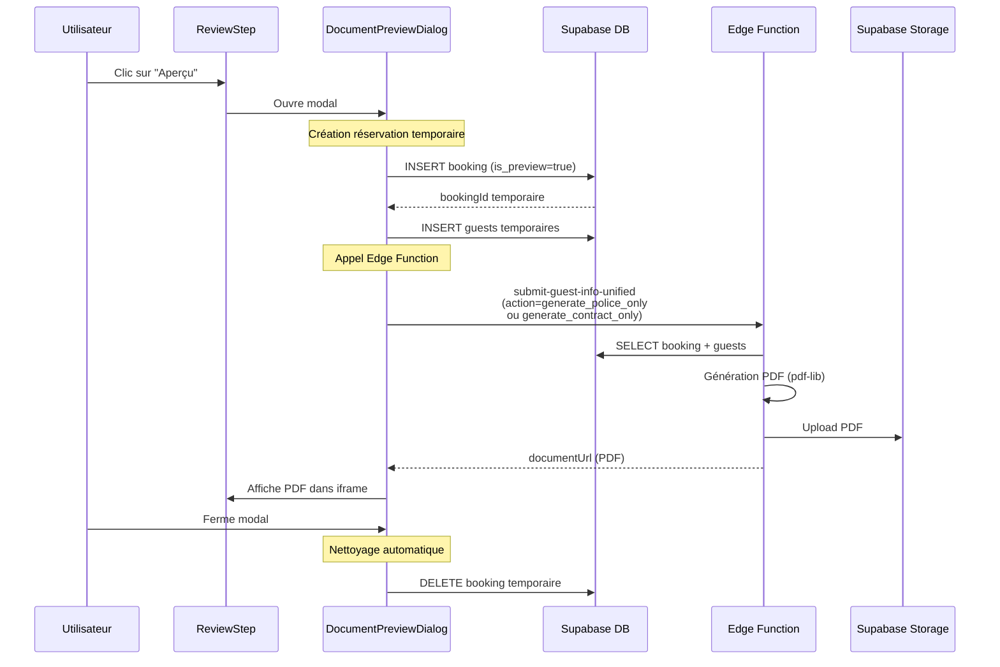

# 🚀 Aperçu Documents via Edge Function

## Date : 24 Novembre 2025

---

## 🎯 Objectif

Au lieu de générer un aperçu HTML simplifié, l'application **appelle maintenant directement l'Edge Function** `submit-guest-info-unified` pour générer les **vrais documents PDF** avec le format officiel, puis les affiche dans un iframe.

---

## ✨ Fonctionnement

### Flux Complet



---

## 📋 Modifications Détaillées

### 1. `DocumentPreviewDialog.tsx` - Refonte Complète

#### Avant (HTML généré côté client)
```typescript
const renderPolicePreview = () => {
  return (
    <div className="bg-white p-8">
      <h1>ROYAUME DU MAROC</h1>
      {/* ... HTML statique ... */}
    </div>
  );
};
```

#### Après (Appel Edge Function)
```typescript
useEffect(() => {
  if (!isOpen) return;

  const generatePreview = async () => {
    setIsGenerating(true);

    // Étape 1 : Créer booking temporaire
    const { data: bookingData } = await supabase
      .from('bookings')
      .insert({
        property_id: propertyId,
        check_in_date: formData.checkInDate,
        check_out_date: formData.checkOutDate,
        number_of_guests: formData.numberOfGuests,
        guest_name: formData.guests[0]?.fullName || 'Aperçu',
        status: 'pending',
        booking_reference: `PREVIEW-${Date.now()}`,
        is_preview: true // ✅ Flag pour identifier les aperçus
      })
      .select()
      .single();

    setTempBookingId(bookingData.id);

    // Étape 2 : Créer guests temporaires
    const guestsToInsert = formData.guests.map(guest => ({
      booking_id: bookingData.id,
      full_name: guest.fullName,
      nationality: guest.nationality,
      document_type: guest.documentType,
      document_number: guest.documentNumber,
      date_of_birth: guest.dateOfBirth,
      place_of_birth: guest.placeOfBirth || null,
      email: guest.email || null
    }));

    await supabase.from('guests').insert(guestsToInsert);

    // Étape 3 : Appeler Edge Function
    const action = documentType === 'police' 
      ? 'generate_police_only' 
      : 'generate_contract_only';

    const { data: docData } = await supabase.functions.invoke(
      'submit-guest-info-unified',
      {
        body: {
          action,
          bookingId: bookingData.id,
          skipEmail: true
        }
      }
    );

    const url = documentType === 'police' 
      ? docData?.policeUrl 
      : docData?.contractUrl;

    setDocumentUrl(url); // Afficher le PDF
    setIsGenerating(false);
  };

  generatePreview();
}, [isOpen, documentType, formData, propertyId]);

// ✅ Nettoyage automatique
useEffect(() => {
  return () => {
    if (tempBookingId) {
      supabase.from('bookings')
        .delete()
        .eq('id', tempBookingId);
    }
  };
}, [tempBookingId]);
```

**Affichage du PDF** :
```tsx
<iframe
  src={documentUrl}
  className="w-full h-full"
  title="Aperçu Document"
/>
```

---

### 2. `ReviewStep.tsx` - Ajout `propertyId`

```typescript
interface ReviewStepProps {
  formData: BookingFormData;
  updateFormData: (updates: BookingFormUpdate) => void;
  bookingId?: string;
  propertyId: string; // ✅ NOUVEAU : Requis pour Edge Function
}

export const ReviewStep = ({ formData, bookingId, propertyId }: ReviewStepProps) => {
  // ...
  
  return (
    <>
      {/* ... */}
      
      {previewDocument && (
        <DocumentPreviewDialog
          isOpen={!!previewDocument}
          onClose={() => setPreviewDocument(null)}
          documentType={previewDocument}
          formData={formData}
          propertyId={propertyId} // ✅ Transmission
        />
      )}
    </>
  );
};
```

---

### 3. `BookingWizard.tsx` - Transmission `propertyId`

```typescript
<CardContent className="p-6">
  <CurrentStepComponent
    formData={formData}
    updateFormData={updateFormData}
    propertyId={propertyId || editingBooking?.propertyId || ''} // ✅ Ajouté
  />
</CardContent>
```

---

## 🗄️ Structure Base de Données

### Colonne `is_preview` (Nouvelle)

**Table** : `bookings`

```sql
ALTER TABLE bookings 
ADD COLUMN is_preview BOOLEAN DEFAULT FALSE;
```

**Utilité** : Identifier et nettoyer facilement les bookings temporaires créés pour les aperçus.

**Nettoyage automatique** (optionnel via cronjob) :
```sql
-- Supprimer les aperçus de plus de 1h
DELETE FROM bookings 
WHERE is_preview = TRUE 
AND created_at < NOW() - INTERVAL '1 hour';
```

---

## 🎨 États de l'Interface

### 1. Chargement
```
┌─────────────────────────────────────────┐
│ Aperçu - Fiche de Police           [X] │
├─────────────────────────────────────────┤
│                                         │
│          ⏳ (spinner)                   │
│   Génération du document en cours...    │
│                                         │
│   Appel à l'Edge Function -             │
│   Cela peut prendre quelques secondes   │
│                                         │
└─────────────────────────────────────────┘
```

### 2. Succès
```
┌─────────────────────────────────────────┐
│ Aperçu - Fiche de Police           [X] │
├─────────────────────────────────────────┤
│ ┌─────────────────────────────────────┐ │
│ │                                     │ │
│ │    [PDF affiché dans iframe]        │ │
│ │                                     │ │
│ └─────────────────────────────────────┘ │
├─────────────────────────────────────────┤
│ ✅ Document généré avec le format       │
│ officiel de l'Edge Function             │
│                     [Télécharger][Fermer]│
└─────────────────────────────────────────┘
```

### 3. Erreur
```
┌─────────────────────────────────────────┐
│ Aperçu - Fiche de Police           [X] │
├─────────────────────────────────────────┤
│                                         │
│          ⚠️ (icône erreur)              │
│      Erreur de génération               │
│                                         │
│   [Message d'erreur détaillé]           │
│                                         │
│              [Fermer]                   │
│                                         │
└─────────────────────────────────────────┘
```

---

## ⚙️ Actions Edge Function

### `generate_police_only`

**Entrée** :
```json
{
  "action": "generate_police_only",
  "bookingId": "uuid-du-booking-temporaire",
  "skipEmail": true
}
```

**Traitement** :
1. Récupère le booking et les guests depuis la DB
2. Génère le PDF de la fiche de police avec `pdf-lib`
3. Upload dans Supabase Storage (`guest-documents`)
4. Retourne l'URL signée

**Sortie** :
```json
{
  "policeUrl": "https://storage.supabase.co/..."
}
```

---

### `generate_contract_only`

**Entrée** :
```json
{
  "action": "generate_contract_only",
  "bookingId": "uuid-du-booking-temporaire",
  "skipEmail": true
}
```

**Traitement** :
1. Récupère le booking, les guests, et la propriété depuis la DB
2. Génère le PDF du contrat avec `pdf-lib`
3. Upload dans Supabase Storage
4. Retourne l'URL signée

**Sortie** :
```json
{
  "contractUrl": "https://storage.supabase.co/..."
}
```

---

## 🧪 Tests

### Test 1 : Aperçu Fiche de Police
1. Ouvrir `BookingWizard`
2. Renseigner dates (ex: 01/12/2025 → 05/12/2025)
3. Ajouter 1 client avec toutes les infos
4. Aller à l'étape "Vérification"
5. Cliquer sur **"Aperçu"** (Fiche de Police)
6. ✅ **Attendu** :
   - Spinner "Génération en cours..."
   - Après 3-5 secondes : PDF affiché dans iframe
   - Format identique à celui généré en production
   - Toutes les infos du client présentes
7. Fermer le modal
8. ✅ **Vérifier** : Booking temporaire supprimé de la DB

### Test 2 : Aperçu Contrat
1. Dans la même réservation
2. Cliquer sur **"Aperçu"** (Contrat)
3. ✅ **Attendu** :
   - Spinner "Génération en cours..."
   - Après 3-5 secondes : PDF affiché dans iframe
   - Contrat complet avec articles
   - Informations du premier guest
   - Durée : 4 nuit(s)
   - Dates correctes

### Test 3 : Plusieurs Clients
1. Ajouter 3 clients
2. Cliquer sur "Aperçu" (Police)
3. ✅ **Attendu** : 3 fiches dans le même PDF

### Test 4 : Gestion Erreurs
1. Désactiver temporairement l'Edge Function (ou simuler erreur)
2. Cliquer sur "Aperçu"
3. ✅ **Attendu** : Message d'erreur clair avec icône ⚠️

---

## 🔍 Logs à Surveiller

### Console Navigateur (Front-End)
```
🎨 [PREVIEW] Génération aperçu { documentType: "police", propertyId: "..." }
✅ [PREVIEW] Booking temporaire créé: abc-123-def-456
✅ [PREVIEW] Guests temporaires créés
📤 [PREVIEW] Appel Edge Function: { action: "generate_police_only", bookingId: "abc-123-def-456" }
✅ [PREVIEW] Document généré: https://storage.supabase.co/...
🗑️ [PREVIEW] Booking temporaire supprimé: abc-123-def-456
```

### Console Edge Function (Supabase Dashboard)
```
[INFO] Action generate_police_only détectée
[INFO] Récupération booking: abc-123-def-456
[INFO] Génération PDF fiche de police pour 1 guest(s)
[INFO] PDF généré: 2.3 KB
[INFO] Upload Storage: guest-documents/police-abc-123-def-456.pdf
[INFO] URL signée générée
```

---

## ⚠️ Points d'Attention

### 1. Edge Function DOIT être déployée
```bash
supabase functions deploy submit-guest-info-unified
```

### 2. Actions `generate_police_only` et `generate_contract_only`
Ces actions doivent exister dans l'Edge Function. Si ce n'est pas le cas, ajouter dans `index.ts` :

```typescript
} else if (requestBody.action === 'generate_police_only') {
  // Validation
  if (!requestBody.bookingId) {
    throw new Error('bookingId requis pour generate_police_only');
  }
  
  // Générer uniquement la fiche de police
  bookingId = requestBody.bookingId;
  policeUrl = await generatePoliceFormsInternal(bookingId);
  
  return new Response(JSON.stringify({
    success: true,
    policeUrl
  }), {
    headers: corsHeaders
  });
  
} else if (requestBody.action === 'generate_contract_only') {
  // Validation
  if (!requestBody.bookingId) {
    throw new Error('bookingId requis pour generate_contract_only');
  }
  
  // Générer uniquement le contrat
  bookingId = requestBody.bookingId;
  contractUrl = await generateContractInternal(bookingId);
  
  return new Response(JSON.stringify({
    success: true,
    contractUrl
  }), {
    headers: corsHeaders
  });
}
```

### 3. Nettoyage des Aperçus
Les bookings temporaires sont supprimés automatiquement à la fermeture du modal. Pour plus de sécurité, créer un cronjob :

```sql
-- Fonction de nettoyage
CREATE OR REPLACE FUNCTION cleanup_preview_bookings()
RETURNS void AS $$
BEGIN
  DELETE FROM bookings 
  WHERE is_preview = TRUE 
  AND created_at < NOW() - INTERVAL '1 hour';
END;
$$ LANGUAGE plpgsql;

-- Cronjob (via pg_cron ou Supabase Scheduler)
-- Exécuter toutes les heures
```

---

## 📊 Comparaison

| Aspect | Avant (HTML) | Après (Edge Function) |
|--------|--------------|------------------------|
| Format | HTML simplifié | **PDF officiel** |
| Génération | Client-side (React) | **Server-side (pdf-lib)** |
| Conformité | Approximatif | **100% identique à production** |
| Performance | Instantané | 3-5 secondes |
| Fiabilité | Dépend du code React | **Même code que production** |
| Maintenance | 2 templates (HTML + PDF) | **1 seul template (PDF)** |

---

## ✅ Avantages

1. **✅ Format Officiel** : Aperçu identique au document final
2. **✅ Maintenance Simplifiée** : Un seul code pour aperçu et production
3. **✅ Validation Réelle** : Teste aussi l'Edge Function
4. **✅ Détection Erreurs** : Si l'aperçu échoue, la production échouera aussi
5. **✅ Conformité** : Garantit que l'aperçu respecte les normes

---

## 🚀 Prochaines Étapes

1. ✅ **Déployer l'Edge Function** avec les actions `generate_police_only` et `generate_contract_only`
2. ✅ **Ajouter colonne `is_preview`** dans la table `bookings`
3. ✅ **Tester l'aperçu** dans le navigateur
4. ⏳ **Mettre en place le cronjob** de nettoyage (optionnel)

---

**Date de révision** : 24 Novembre 2025  
**Version** : 2.0 (Aperçu via Edge Function)  
**Status** : ✅ Implémenté - En attente de déploiement Edge Function

