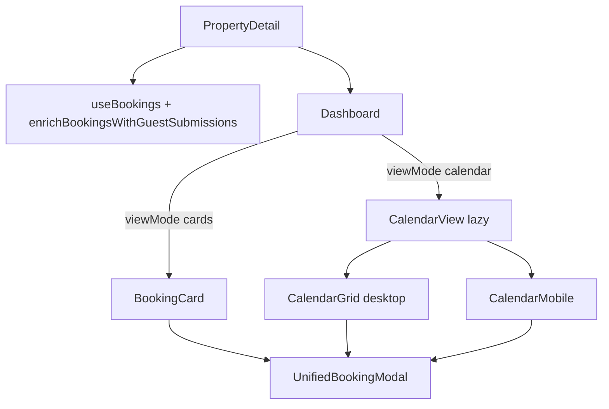
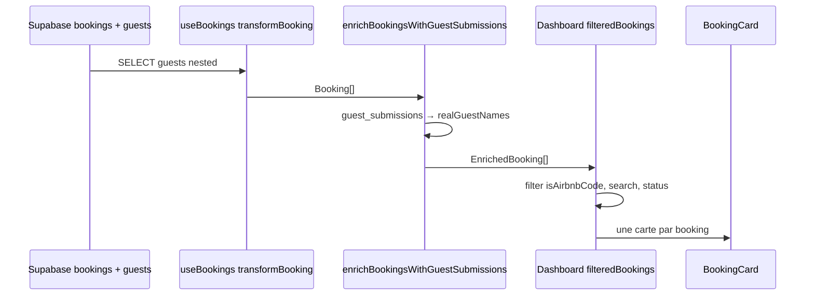

# Analyse Calendrier & affichage des réservations (hôte)

Document de référence sur le **tableau de bord des réservations** : vue **Cartes**, vue **Calendrier**, **sources de données**, **affichage des invités / titres**, conflits de logique, synchronisation Airbnb et points de vigilance.

**Périmètre fonctionnel** : tout ce qui contribue à **afficher une réservation** et ses **informations** (nom, dates, invités, documents, statuts) dans le parcours hôte — pas seulement la grille calendrier.

---

## 1. Vue d’ensemble : flux hôte

Le dashboard n’est pas une page isolée : il est **embarqué dans la fiche propriété** (`PropertyDetail`).

- **`useBookings`** : charge les réservations **manuelles** (`bookings` + relation **`guests`**), puis **`enrichBookingsWithGuestSubmissions`** (`guestSubmissionService.ts`) ajoute `realGuestNames`, `hasRealSubmissions`, etc.
- **`CalendarView`** : ajoute les séjours **Airbnb** issus de **`airbnb_reservations`** (via `calendarData.ts`) si l’URL ICS est configurée.

---

## 2. Cartographie exhaustive des fichiers (affichage réservations)

Les fichiers ci-dessous interviennent dans **l’affichage** ou la **préparation des données affichées** pour les réservations côté hôte. Ils complètent la table « Fichiers clés » en fin de document.

### 2.1 Shell UI & navigation

| Fichier | Rôle |
|---------|------|
| `src/components/PropertyDetail.tsx` | Route propriété : `useBookings`, passage de `bookings` / callbacks au `Dashboard`, stats hover sur réservations |
| `src/components/Dashboard.tsx` | Bascule `cards` / `calendar`, filtres et liste cartes, lazy-load `CalendarView` |
| `src/components/PropertyDashboard.tsx` | Variante plus simple du dashboard (si utilisée ailleurs) — à ne pas confondre avec `PropertyDetail` + `Dashboard` |

### 2.2 Vue cartes

| Fichier | Rôle |
|---------|------|
| `src/components/BookingCard.tsx` | Carte unitaire : **titre**, dates, `numberOfGuests`, **liste `booking.guests`**, badges documents, actions |
| `src/components/BookingWizard.tsx` | Création / édition réservation (alimente ensuite `guests` en base) |

### 2.3 Vue calendrier

| Fichier | Rôle |
|---------|------|
| `src/components/CalendarView.tsx` | Orchestration : ICS, caches, `allReservations`, conflits, modales, realtime |
| `src/components/calendar/CalendarHeader.tsx` | Mois, stats, sync ICS, bascule cartes/calendrier |
| `src/components/calendar/CalendarGrid.tsx` | Grille desktop, barres, groupes conflit, `ConflictCadran` |
| `src/components/calendar/CalendarMobile.tsx` | Calendrier mobile multi-mois |
| `src/components/calendar/CalendarBookingBar.tsx` | Barre unitaire (couleurs, libellé une ligne) |
| `src/components/calendar/CalendarUtils.ts` | `generateCalendarDays`, `calculateBookingLayout`, `detectBookingConflicts`, helpers dates |
| `src/components/calendar/ConflictCadran.tsx` | Panneau liste des réservations en conflit (desktop) |
| `src/components/calendar/ConflictCadran.tsx` / `ConflictModal.tsx` | Modal conflits sur mobile (`CalendarView` branche mobile) |
| `src/components/calendar/AirbnbSyncModal.tsx` | UI sync Airbnb (si ouvert depuis le flux calendrier) |
| `src/services/calendarData.ts` | Lecture `airbnb_reservations`, événements, cache court |
| `src/services/airbnbSyncService.ts` | Types `AirbnbReservation` |
| `src/services/airbnbEdgeFunctionService.ts` | Appel sync ICS côté Edge |

### 2.4 Détail réservation (toutes vues)

| Fichier | Rôle |
|---------|------|
| `src/components/UnifiedBookingModal.tsx` | Modale au clic barre/carte : documents, lien invité, logique « guests complets », chargement pièces |
| `src/components/ConflictModal.tsx` | Détail conflits (mobile notamment) |

### 2.5 Données, enrichissement, libellés

| Fichier | Rôle |
|---------|------|
| `src/hooks/useBookings.ts` | SELECT `bookings` + nested `guests`, transformation `transformBooking`, cache, refresh |
| `src/services/guestSubmissionService.ts` | **`enrichBookingsWithGuestSubmissions`** : `realGuestNames`, `realGuestCount`, flags soumissions |
| `src/utils/bookingDisplay.ts` | **`getUnifiedBookingDisplayText`**, **`getGuestInitials`**, `cleanGuestName`, `isValidGuestName`, `formatGuestDisplayName` — **source de vérité pour titres courts** (calendrier, modale) |
| `src/utils/bookingDocuments.ts` | **`getBookingDocumentStatus`** / `hasAllRequiredDocumentsForCalendar` — utilisé pour conflits « validés », filtres potentiels |
| `src/utils/airbnbCodeFilter.ts` | **`isAirbnbCode`** — exclusion cartes pour références type HM… / UID: |
| `src/constants/bookingColors.ts` | Couleurs conflit / manuel / Airbnb / terminé |

### 2.6 Types

| Fichier | Rôle |
|---------|------|
| `src/types/booking.ts` | `Booking`, `Guest` (`id?` optionnel côté type) |

---

## 3. Bascule Cartes / Calendrier

| Aspect | Implémentation |
|--------|----------------|
| État | `viewMode: 'cards' \| 'calendar'` dans `Dashboard.tsx` (défaut **`calendar`**) |
| Calendrier | `CalendarHeader` : `viewMode` / `onViewModeChange` |
| Cartes | Boutons Cartes/Calendrier visibles surtout depuis la vue cartes ; en vue calendrier, bascule via **`CalendarHeader`** |

`Suspense` autour de `CalendarView` évite de charger le module calendrier tant que l’utilisateur reste en cartes.

---

## 4. Vue Cartes — workflow structuré

### 4.1 Chaîne de données (de la base à la carte)

1. **`useBookings`** interroge `bookings` avec la relation **`guests`** (`full_name`, `date_of_birth`, etc. — voir `BOOKINGS_SELECT`).
2. **`transformBooking`** mappe chaque ligne `guests` vers le type `Guest` **sans repasser l’`id` UUID** des lignes `guests` dans l’objet retourné (les champs mappés sont surtout `fullName`, `nationality`, …).
3. **`enrichBookingsWithGuestSubmissions`** fusionne les **`guest_submissions`** pour produire **`realGuestNames`** (noms issus des soumissions réelles, dédupliqués, normalisés en **MAJUSCULES** dans le service).
4. **`Dashboard`** applique **`filteredBookings`** (exclusion codes Airbnb, recherche, statut dérivé documents).
5. **`BookingCard`** affiche une **carte par réservation** ; la liste d’invités affichée est **`booking.guests`** (tableau issu du wizard / API), pas directement `realGuestNames` (sauf pour le **titre** — voir ci-dessous).

### 4.2 Qu’est-ce qui est affiché comme « invités » sur la carte ?

| Zone UI | Contenu | Source |
|---------|---------|--------|
| **Titre (h3)** | Un seul nom « principal » | Logique **locale** dans `BookingCard` : `realGuestNames[0]` si présent → sinon `signerName` (signature) → sinon `getUnifiedBookingDisplayText` → sinon `guests[0].fullName` / `guest_name` / libellé défaut |
| **« X client(s) »** | Nombre | **`booking.numberOfGuests`** (champ réservation), pas `guests.length` |
| **Bloc « Clients enregistrés »** | Liste nom + nationalité | **`booking.guests.map`** — **tous** les objets `guest` du tableau, **si** `guests.length > 0` |
| Badges documents / soumissions | Contrat, police, compteurs | `booking.documentsGenerated`, requêtes async (`BookingVerificationService`, `uploaded_documents`, etc.) |

**Conséquence** : la carte peut afficher un **titre** basé sur **`realGuestNames[0]`** (soumissions) alors que la **liste** sous « Clients enregistrés » reflète uniquement les lignes **`guests`** persistées côté `bookings`. Si les soumissions arrivent **avant** que le wizard / la sync n’aient rempli toutes les lignes `guests`, ou si le nombre de soumissions diffère de `numberOfGuests`, l’utilisateur peut voir un **décalage** entre titre, compteur et liste.

### 4.3 Cohérence avec `getUnifiedBookingDisplayText` (calendrier / modale)

- **`getUnifiedBookingDisplayText`** (`bookingDisplay.ts`) est la règle **unifiée** pour les **titres courts** (barres calendrier, parties de la modale).
- **Priorités** (simplifié) : soumissions réelles (`hasRealSubmissions` + `realGuestNames`) → `guest_name` nettoyé → invités manuels `guests[0]` **si** `isValidGuestName` (ici **exige traditionnellement 2 mots** pour la branche stricte) → code réservation → « Réservation ».
- **`BookingCard`** pour le titre **ne réutilise pas** uniquement cette fonction : elle **préfère `realGuestNames[0]`** et **`signerName`** avant d’appeler `getUnifiedBookingDisplayText`. D’où des **écarts possibles** entre **carte**, **barre calendrier** et **modale** pour une même réservation.

### 4.4 Filtres Dashboard (cartes)

- **`isAirbnbCode(bookingReference)`** → réservation **exclue** des cartes (références HM…, UID:…). Ces séjours restent visibles au **calendrier** (Airbnb + dédup).
- Recherche : référence ou **nom dans `guests[].fullName`**.
- Statut pour filtre : **dérivé** des documents (`contract` + `policeForm`) → `completed` / `pending` pour le select (pas uniquement le `status` SQL brut).

### 4.5 Problématiques & conflits fréquents (cartes / invités)

| Problème | Cause probable dans le code |
|----------|------------------------------|
| Titre ≠ liste des invités | Titre peut venir de **`realGuestNames`** / signature ; liste = **`guests`** SQL |
| « 3 clients » mais 1 ligne dans la liste | **`numberOfGuests`** ≠ nombre de lignes **`guests`** (invités non encore enregistrés en lignes `guests`) |
| Noms en majuscules dans un contexte | **`realGuestNames`** passés en **uppercase** dans `guestSubmissionService` avant affichage titre carte |
| Clés React instables sur les lignes invité | `BookingCard` utilise **`key={guest.id}`** ; si **`id`** absent sur `Guest` (non mappé depuis `useBookings`), plusieurs lignes peuvent avoir **`key={undefined}`** → avertissements React et comportements bizarres au refresh |
| Double logique « nom valide » | `isValidGuestName` dans **`bookingDisplay.ts`** vs copie **`isValidGuestName`** dans **`CalendarBookingBar`** / **`CalendarMobile`** — règles **proches mais pas identiques** |
| Carte sans réservation ICS | Filtre **`isAirbnbCode`** : certaines réservations **n’apparaissent qu’au calendrier** |

---

## 5. Vue Calendrier — pipeline de données

### 5.1 Entrées

1. **`bookings`** enrichis (`EnrichedBooking`).
2. **`airbnbReservations`** via **`fetchAirbnbCalendarEvents`** → table **`airbnb_reservations`**, plage = mois affiché.

### 5.2 ICS / caches / enrichissement

- Sans **`airbnb_ics_url`** : pas de chargement Airbnb dans `CalendarView` (`hasIcs`).
- Caches : classe **`airbnbCache`** dans `CalendarView`, cache **`calendarData.ts`** (~10 s), invalidations après sync.
- Enrichissement croisé Airbnb ↔ booking manuel (mêmes dates / refs) pour **`getUnifiedBookingDisplayText`**.

### 5.3 Fusion `allReservations`

- Airbnb **doublonnées** par un booking manuel sont **retirées** de la couche « uniquement Airbnb ».
- **`SHOW_ALL_BOOKINGS = true`** : pas de filtre strict « documents complets » sur les manuelles (comportement actuel documenté dans le code).

---

## 6. Grille temporelle et barres (`CalendarUtils.ts`)

- **`generateCalendarDays`** : 42 jours, semaine **lundi**.
- **`calculateBookingLayout`** : segments par semaine, **dédup** Airbnb/manuel, **layers**, **`BAR_GAP_PERCENT`** pour adjacences.
- **+1 jour FullCalendar** : corrigé dans `loadAirbnbReservations` (`realEndDate`).

---

## 7. Conflits — deux logiques

- **`detectBookingConflicts`** : chevauchements **+** les deux réservations **validées** au sens documents (`getBookingDocumentStatus`) ; même `bookingReference` ignoré.
- **`conflictDetails` / `conflictGroupsWithPosition`** : chevauchements **sans** ce filtre « deux validées ».

→ Risque de **décalage** entre alerte / couleurs strictes et **groupes rouges** géométriques (voir analyse précédente).

---

## 8. Rendu desktop / mobile

- **`CalendarGrid`** + **`ConflictCadran`** ; barres normales masquées si id dans groupe conflit.
- **`CalendarMobile`** : autre implémentation ; **`ConflictModal`** sur mobile.

---

## 9. Couleurs et libellés des barres (`CalendarBookingBar`)

- Couleur : conflit (liste `conflicts` de `detectBookingConflicts`) → passé → défaut.
- Texte : **`getUnifiedBookingDisplayText`**.

---

## 10. Interactions et temps réel

| Action | Mécanisme |
|--------|-----------|
| Clic réservation | **`UnifiedBookingModal`** |
| Nouvelle réservation | Événement **`create-booking-request`** |
| Refresh | `onRefreshBookings` + invalidation caches |
| Sync ICS | Edge + invalidations |
| Temps réel | `airbnb_reservations` → `debouncedReload` |

---

## 11. Effets de bord automatiques (statuts)

**`matchedBookings`** : passage **`confirmed`** / **`completed`** en base selon documents — **sans action utilisateur** explicite.

---

## 12. Synthèse des risques (global)

| Sujet | Description |
|-------|-------------|
| **Conflit double sémantique** | `conflictDetails` vs `detectBookingConflicts` |
| **Cartes vs calendrier** | Filtre `isAirbnbCode` — séjours seulement calendrier |
| **Titre carte vs titre unifié** | Priorités différentes (`realGuestNames`, `signerName`) |
| **Invités : liste vs compteur** | `guests[]` vs `numberOfGuests` vs `realGuestNames` |
| **Clés React `guest.id`** | `id` souvent non mappé depuis `useBookings` |
| **Caches** | Délais affichage après sync |
| **Mobile vs desktop calendrier** | Duplication de règles « nom valide » |
| **`SHOW_ALL_BOOKINGS`** | Filtre calendrier assoupli |

---

## 13. Fichiers clés (référence rapide — synthèse)

| Fichier | Rôle |
|---------|------|
| `PropertyDetail.tsx` | Entrée propriété, `useBookings`, `Dashboard` |
| `Dashboard.tsx` | Cartes / calendrier, filtres |
| `BookingCard.tsx` | Carte : titre, liste invités, documents |
| `CalendarView.tsx` | Calendrier : ICS, fusion, conflits |
| `calendar/*` | Grille, mobile, barres, header, utilitaires |
| `UnifiedBookingModal.tsx` | Détail réservation au clic |
| `useBookings.ts` | Chargement + transformation `guests` |
| `guestSubmissionService.ts` | `realGuestNames`, enrichissement |
| `bookingDisplay.ts` | Titres unifiés |
| `bookingDocuments.ts` | Validation « complète » / conflits |
| `airbnbCodeFilter.ts` | Filtre cartes |
| `calendarData.ts` | Événements Airbnb |

---

## 14. Fichiers les plus critiques et problématiques

Classement par **impact** sur la fiabilité des données affichées, la cohérence UX et la performance perçue. Les « problématiques » regroupent bugs potentiels, dette technique et risques de désynchronisation.

| Priorité | Fichier | Pourquoi critique | Problématiques principales |
|----------|---------|-------------------|---------------------------|
| **P0** | `CalendarView.tsx` | Cœur du calendrier : fusion manuel + Airbnb, couleurs, conflits, caches, effets DB (`matchedBookings`) | Double sémantique conflits ; flag **`SHOW_ALL_BOOKINGS`** hardcodé ; chaîne de caches ; matching dupliqué avec ailleurs ; logs/console en prod possibles ; subscription realtime + throttle |
| **P0** | `useBookings.ts` | Source unique des `bookings` + enrichissement pour tout le dashboard | Timeout requête 8 s ; **`guests` sans `id` mappé** ; dépendance `multiLevelCache` (TTL 60 s) ; enrichissement async = **latence cumulée** ; debounce 300 ms sur invalidations |
| **P0** | `guestSubmissionService.ts` | Alimente **`realGuestNames`** / compteurs utilisés partout | Cache global **30 s** (tout ou rien) ; timeout requête **15 s** ; **`MAX_BOOKING_IDS` 100** ; noms en **MAJUSCULES** ; structure `guest_data` hétérogène (array vs object) |
| **P1** | `calendar/CalendarUtils.ts` | Layout + **`detectBookingConflicts`** | Règles conflit ≠ `conflictDetails` dans `CalendarView` ; calcul lourd par mois ; duplication logique matching Airbnb/manuel **à l’intérieur** + dans `CalendarView` |
| **P1** | `BookingCard.tsx` | Affichage carte : titre, invités, documents | Titre **non strictement aligné** sur `getUnifiedBookingDisplayText` ; **`key={guest.id}`** sans id ; requêtes async nombreuses par carte (N+1 perçu) ; état documents fragmenté |
| **P1** | `bookingDisplay.ts` | Titres unifiés | **`isValidGuestName`** exige 2 mots — incohérent avec calendrier (1 mot accepté ailleurs) ; logique dense, difficile à tester unitairement |
| **P1** | `UnifiedBookingModal.tsx` | Modale lourde au clic | Multiples requêtes parallèles + edge function background ; **timeouts** (ex. 5 s avant hint manuel) ; gros composant = risque de lenteur ressentie |
| **P2** | `services/calendarData.ts` | Fetch événements Airbnb | Cache **10 s** séparé du cache `CalendarView` (**30 s**) → **double couche** pour la même donnée, fenêtres de staleness différentes |
| **P2** | `calendar/CalendarGrid.tsx` + `CalendarMobile.tsx` | Rendu | Duplication **`isValidGuestName`** / styles ; `memo` avec comparaisons partielles (`bookingLayout`) — risque de **stale UI** si refs d’objets inchangées mais contenu oui |
| **P2** | `Dashboard.tsx` | Filtre cartes | Exclusion **`isAirbnbCode`** sans message explicite à l’utilisateur ; pas de skeleton pendant lazy `CalendarView` au-delà du spinner générique |

**Légende** : P0 = corriger en premier (données / cohérence globale) ; P1 = forte incidence UX ou dette ; P2 = perf, cache, clarté.

---

## 15. Inventaire des problèmes (par thème)

### 15.1 Affichage des informations

| Problème | Où / cause |
|----------|------------|
| Titre carte ≠ barre calendrier ≠ modale | `BookingCard` (priorités locales) vs `getUnifiedBookingDisplayText` |
| Liste invités ≠ titre / `numberOfGuests` | `guests[]` SQL vs `realGuestNames` vs `numberOfGuests` |
| Conflit « affiché » vs « compté » | `conflictDetails` (géométrie rouge) vs `detectBookingConflicts` (ids rouges / alerte) |
| Réservations ICS seulement au calendrier | Filtre cartes `isAirbnbCode` sans explication UI |
| Statut auto `confirmed` / `completed` | `CalendarView` + matching — l’hôte peut ne pas comprendre le changement |

### 15.2 Latence et temps d’attente

| Mécanisme | Valeur indicative | Effet utilisateur |
|-----------|-------------------|-------------------|
| `BOOKINGS_QUERY_TIMEOUT` | 8 s (`useBookings`) | Échec ou liste vide si réseau lent |
| Enrichissement soumissions | jusqu’à **15 s** race (`guestSubmissionService`) | Cartes sans noms enrichis puis « pop » |
| `UnifiedBookingModal` chargement docs | timeout 5 s avant message « vérifier manuellement » | Attente ou impression de blocage |
| Chaîne `loadBookings` : cache → fetch → enrich | séquentiel / async | **First paint** avec données partielles |
| Lazy `CalendarView` | chargement chunk JS | Premier passage calendrier : délai supplémentaire |

### 15.3 Cache et fraîcheur des données

| Cache | TTL / comportement | Risque |
|-------|-------------------|--------|
| `multiLevelCache` (bookings) | 60 s | Liste hôte **périmée** jusqu’à refresh ou invalidation |
| `guestSubmissionService` submissions | 30 s global | Changement soumission retardé ; **`invalidateSubmissionsCache`** doit être appelé partout où pertinent |
| `calendarData` `airbnbEventsCache` | 10 s | Événements Airbnb **pas à jour** < 10 s après sync si pas d’invalidation |
| `airbnbCache` (`CalendarView`) | 30 s | Même plage mois = anciennes barres après sync Edge si cache non vidé |
| Double cache ICS | `calendarData` **+** `CalendarView` | Fenêtres incohérentes ; besoin de **stratégie d’invalidation unique** documentée |

### 15.4 Matching manuel ↔ Airbnb (évaluation)

La logique « même réservation » (dates égales ou références qui s’incluent) est **réimplémentée** à plusieurs endroits :

- `CalendarView` (enrichissement Airbnb, `allReservations`, `matchedBookings`, couleurs),
- `CalendarUtils.calculateBookingLayout` (filtrage doublons par semaine),
- Effets de bord : mise à jour **statut** booking quand match détecté.

**Problèmes** : dérive si une branche est modifiée sans les autres ; pas de module **`matchManualToAirbnb(booking, airbnb)`** unique testé ; comparaisons de dates sensibles au fuseau si non normalisées de la même façon partout.

**Recommandation (sans hardcoder les règles métier dans l’UI)** : centraliser dans un module dédié (ex. `bookingAirbnbMatch.ts`) avec **fonctions pures**, tests unitaires, et éventuellement **seuils / flags** lus depuis une config ou constantes nommées (`MATCH_TOLERANCE_DAYS` si un jour introduit tolérance).

### 15.5 Hardcode et flags « temporaires »

| Élément | Fichier | Risque |
|---------|---------|--------|
| `SHOW_ALL_BOOKINGS = true` | `CalendarView` | Comportement calendrier **non aligné** sur la règle métier « documents complets » documentée en commentaire |
| `MIN_RELOAD_INTERVAL = 5000` | `CalendarView` | Realtime peut sembler « en retard » jusqu’à 5 s |
| TTL / timeouts éparpillés | plusieurs fichiers | Difficile d’harmoniser **fraîcheur vs charge** sans tableau central |

**Orientation** : regrouper durées dans **`src/config/cache.ts`** ou variables d’environnement **`VITE_*`** pour ajuster sans toucher à la logique métier ; éviter de dupliquer les **mêmes nombres** dans trois services.

---

## 16. Liste prioritaire des fichiers à corriger (ordre suggéré)

Objectif : **réduire les incohérences d’affichage**, **maîtriser latence/cache**, **éliminer la duplication de matching** — **sans** disperser de nouvelles constantes magiques dans les composants.

1. **`useBookings.ts`** — Mapper **`id`** sur chaque `guest` ; garantir une structure stable pour listes / clés React.
2. **`BookingCard.tsx`** — Unifier le titre via **`getUnifiedBookingDisplayText`** (ou wrapper unique) ; clés **`guest.id ?? index`** en secours ; réduire requêtes redondantes (batch ou hook parent).
3. **`guestSubmissionService.ts`** — Documenter / ajuster stratégie cache (invalidation après mutation) ; éviter normalisation **MAJUSCULE** en amont si l’UI doit afficher casse naturelle (ou formater à l’affichage uniquement).
4. **`CalendarView.tsx`** — Remplacer **`SHOW_ALL_BOOKINGS`** par config centralisée ou feature flag ; **aligner** `conflictDetails` avec `detectBookingConflicts` **ou** documenter explicitement deux niveaux (overlap brut vs conflit « légal »).
5. **Module matching unique** — Extraire les conditions de match + les réutiliser dans layout et effets statut.
6. **`calendarData.ts` + `CalendarView` caches** — Une politique d’invalidation commune après sync / refresh (éviter double TTL opposé).
7. **`bookingDisplay.ts` + barres calendrier** — Une seule implémentation **`isValidGuestName`** (import depuis `bookingDisplay` ou package `shared/validation`).
8. **`UnifiedBookingModal.tsx`** — Découper chargements ; feedback chargement explicite ; réduire logs en production.

---

## 17. Synthèse exécutive

- **Le plus risqué pour la « vérité » affichée** : `CalendarView` + `useBookings` + `guestSubmissionService` (caches superposés, matching dupliqué, flags).
- **Le plus risqué pour la confiance utilisateur sur les invités** : `BookingCard` + absence d’`id` guest + titres multi-sources.
- **Le plus risqué pour la latence perçue** : enchaînement fetch → enrichissement → second fetch modale, avec plusieurs timeouts indépendants.

---

*Document à maintenir lors des évolutions sur `BookingCard`, `getUnifiedBookingDisplayText`, enrichissement soumissions, filtres cartes, politique de cache et module de matching Airbnb/manuel.*
