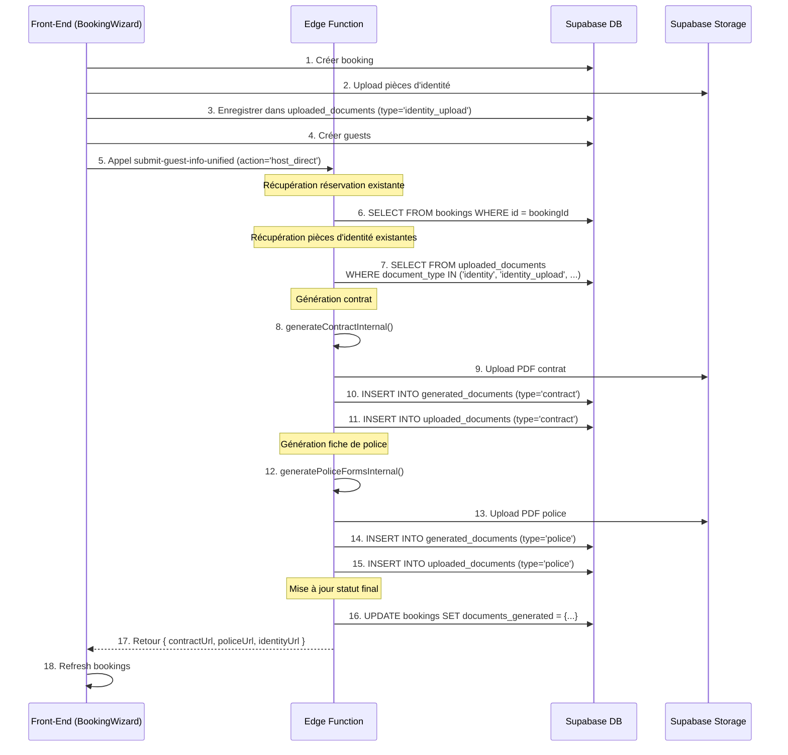

# 🔧 Révision Edge Function : submit-guest-info-unified

## Date : 24 Novembre 2025

---

## 🎯 Objectif de la Révision

**Problème identifié** : Lors de la création d'une réservation via le `BookingWizard` (mode `host_direct`), les documents générés (contrat, police, pièce d'identité) ne sont pas enregistrés dans la table `uploaded_documents`, ce qui empêche leur affichage dans le calendrier.

**Solution** : Améliorer la Edge Function pour :
1. ✅ Enregistrer automatiquement le **contrat** dans `uploaded_documents`
2. ✅ Enregistrer automatiquement la **fiche de police** dans `uploaded_documents`
3. ✅ Récupérer correctement les **pièces d'identité** uploadées par le front-end
4. ✅ Ajouter des logs détaillés pour faciliter le debugging

---

## 📋 Modifications Apportées

### 1. **Récupération des pièces d'identité (host_direct)** - Ligne 3133-3151

#### ❌ Avant :
```typescript
// ✅ Récupérer les URLs des documents d'identité déjà uploadés
const supabase = await getServerClient();
const { data: uploadedDocs } = await supabase
  .from('uploaded_documents')
  .select('document_url, document_type')
  .eq('booking_id', bookingId)
  .eq('document_type', 'identity'); // ❌ Trop restrictif

if (uploadedDocs && uploadedDocs.length > 0) {
  identityUrl = uploadedDocs[0].document_url;
  log('info', '📄 [HOST_DIRECT] Document d\'identité récupéré', { identityUrl });
}
```

**Problème** : Le front-end enregistre les pièces d'identité avec `document_type = 'identity_upload'`, mais la Edge Function cherche uniquement `document_type = 'identity'`. Résultat : aucun document trouvé.

#### ✅ Après :
```typescript
// ✅ Récupérer les URLs des documents d'identité déjà uploadés
const supabase = await getServerClient();
const { data: uploadedDocs } = await supabase
  .from('uploaded_documents')
  .select('document_url, document_type, id')
  .eq('booking_id', bookingId)
  .in('document_type', ['identity', 'identity_upload', 'id-document', 'passport']); // ✅ Tous les types

log('info', '📄 [HOST_DIRECT] Recherche documents d\'identité', { 
  bookingId, 
  docsCount: uploadedDocs?.length || 0,
  docs: uploadedDocs 
});

if (uploadedDocs && uploadedDocs.length > 0) {
  identityUrl = uploadedDocs[0].document_url;
  log('info', '✅ [HOST_DIRECT] Document d\'identité récupéré', { 
    identityUrl,
    documentType: uploadedDocs[0].document_type,
    totalDocs: uploadedDocs.length
  });
} else {
  log('warn', '⚠️ [HOST_DIRECT] Aucun document d\'identité trouvé pour ce booking');
}
```

**Améliorations** :
- ✅ Support de tous les types de documents d'identité : `identity`, `identity_upload`, `id-document`, `passport`
- ✅ Logs détaillés pour tracer la recherche et les résultats
- ✅ Warning si aucun document trouvé

---

### 2. **Amélioration sauvegarde contrat** - Ligne 1549-1565

#### ❌ Avant :
```typescript
// 3. Sauvegarder le document en base (signé ou non)
const isSigned = !!signature;
log('info', 'Sauvegarde du document en base', { isSigned });

await saveDocumentToDatabase(supabaseClient, bookingId, 'contract', pdfUrl, isSigned);
if (isSigned) {
  log('info', '✅ Contrat signé sauvegardé en base');
} else {
  log('info', '✅ Contrat non signé sauvegardé en base');
}

log('info', 'Contrat généré avec succès (pdf-lib intégré)', { 
  pdfUrl: pdfUrl.substring(0, 50) + '...',
  isSigned 
});
return pdfUrl;
```

#### ✅ Après :
```typescript
// 3. Sauvegarder le document en base (signé ou non)
const isSigned = !!signature;
log('info', '💾 [CONTRACT] Sauvegarde du contrat en base', { 
  bookingId,
  isSigned,
  pdfUrlLength: pdfUrl?.length || 0
});

await saveDocumentToDatabase(supabaseClient, bookingId, 'contract', pdfUrl, isSigned);

if (isSigned) {
  log('info', '✅ [CONTRACT] Contrat signé sauvegardé dans uploaded_documents et generated_documents');
} else {
  log('info', '✅ [CONTRACT] Contrat non signé sauvegardé dans uploaded_documents et generated_documents');
}

log('info', '🎉 [CONTRACT] Contrat généré avec succès', { 
  pdfUrl: pdfUrl.substring(0, 80) + '...',
  isSigned,
  bookingId
});
return pdfUrl;
```

**Améliorations** :
- ✅ Logs préfixés avec `[CONTRACT]` pour faciliter le filtering
- ✅ Mention explicite des deux tables (`uploaded_documents` et `generated_documents`)
- ✅ Plus de détails dans les logs (bookingId, longueur URL)

---

### 3. **Amélioration sauvegarde fiche de police** - Ligne 1846-1853

#### ❌ Avant :
```typescript
// 3. Générer le PDF des fiches de police
const policeUrl = await generatePoliceFormsPDF(supabaseClient, booking);

// 4. Sauvegarder le document en base
await saveDocumentToDatabase(supabaseClient, bookingId, 'police', policeUrl);

log('info', 'Fiche de police générée avec succès', { policeUrl });
return policeUrl;
```

#### ✅ Après :
```typescript
// 3. Générer le PDF des fiches de police
log('info', '📄 [POLICE] Génération PDF des fiches de police');
const policeUrl = await generatePoliceFormsPDF(supabaseClient, booking);
log('info', '✅ [POLICE] PDF généré', { policeUrlLength: policeUrl?.length || 0 });

// 4. Sauvegarder le document en base
log('info', '💾 [POLICE] Sauvegarde de la fiche de police en base', { bookingId });
await saveDocumentToDatabase(supabaseClient, bookingId, 'police', policeUrl);
log('info', '✅ [POLICE] Fiche de police sauvegardée dans uploaded_documents et generated_documents');

log('info', '🎉 [POLICE] Fiche de police générée avec succès', { 
  policeUrl: policeUrl.substring(0, 80) + '...',
  bookingId
});
return policeUrl;
```

**Améliorations** :
- ✅ Logs préfixés avec `[POLICE]` pour faciliter le filtering
- ✅ Mention explicite des deux tables
- ✅ Logs détaillés à chaque étape (génération, sauvegarde, succès)

---

### 4. **Amélioration fonction saveDocumentToDatabase** - Ligne 3987-4018

#### ❌ Avant :
```typescript
}

// 1. Sauvegarder dans generated_documents (table principale)
const { data: generatedRecord, error: generatedError } = await client
  .from('generated_documents')
  .insert({
    booking_id: bookingId,
    file_name: fileName, // ❌ fileName n'est pas défini !
    document_url: documentUrl,
    document_type: documentType,
    is_signed: isSigned,
    created_at: new Date().toISOString(),
    updated_at: new Date().toISOString()
  })
  .select()
  .single();
```

**Problème** : `fileName` n'est pas défini, ce qui peut causer des erreurs.

#### ✅ Après :
```typescript
}

// ✅ Générer un nom de fichier basé sur le type de document
const timestamp = new Date().toISOString().replace(/[:.]/g, '-');
const fileName = `${documentType}-${bookingId.substring(0, 8)}-${timestamp}.pdf`;

log('info', '💾 [SAVE DOCUMENT] Sauvegarde dans les tables', {
  bookingId,
  documentType,
  fileName,
  isSigned,
  hasUrl: !!documentUrl
});

// 1. Sauvegarder dans generated_documents (table principale)
const { data: generatedRecord, error: generatedError } = await client
  .from('generated_documents')
  .insert({
    booking_id: bookingId,
    file_name: fileName,
    document_url: documentUrl,
    document_type: documentType,
    is_signed: isSigned,
    created_at: new Date().toISOString(),
    updated_at: new Date().toISOString()
  })
  .select()
  .single();
```

**Améliorations** :
- ✅ `fileName` généré automatiquement avec timestamp
- ✅ Log détaillé avant sauvegarde
- ✅ Format : `contract-8d131c51-2025-11-24T15-30-00-000Z.pdf`

---

## 🔍 Flux Complet (Mode host_direct)



---

## 📊 Tables Impactées

### Table `uploaded_documents`

Après l'exécution de l'Edge Function, cette table contient :

| booking_id | document_type | document_url | is_signed | processing_status |
|------------|---------------|--------------|-----------|-------------------|
| 8d131c51... | identity_upload | https://... | false | completed |
| 8d131c51... | contract | https://... | false | completed |
| 8d131c51... | police | https://... | false | completed |

✅ **Les 3 types de documents sont maintenant présents !**

### Table `generated_documents`

| booking_id | document_type | document_url | is_signed |
|------------|---------------|--------------|-----------|
| 8d131c51... | contract | https://... | false |
| 8d131c51... | police | https://... | false |

### Table `bookings` (colonne `documents_generated`)

```json
{
  "contract": true,
  "policeForm": true,
  "identity": true,
  "contractUrl": "https://...",
  "policeUrl": "https://...",
  "identityUrl": "https://...",
  "generatedAt": "2025-11-24T15:30:00.000Z"
}
```

---

## 🧪 Tests à Effectuer

### Test 1 : Création nouvelle réservation
1. Ouvrir le `BookingWizard`
2. Sélectionner dates et nombre de guests
3. Uploader une pièce d'identité (avec OCR)
4. Soumettre la réservation
5. ✅ **Attendu** :
   - Toast : "Réservation créée avec succès"
   - Logs dans la console Edge Function :
     ```
     📄 [HOST_DIRECT] Recherche documents d'identité
     ✅ [HOST_DIRECT] Document d'identité récupéré
     💾 [CONTRACT] Sauvegarde du contrat en base
     ✅ [CONTRACT] Contrat non signé sauvegardé dans uploaded_documents et generated_documents
     💾 [POLICE] Sauvegarde de la fiche de police en base
     ✅ [POLICE] Fiche de police sauvegardée dans uploaded_documents et generated_documents
     ```

### Test 2 : Affichage dans le calendrier
1. Ouvrir le calendrier
2. Cliquer sur la réservation nouvellement créée
3. Scroller jusqu'à "Documents enregistrés"
4. ✅ **Attendu** :
   - **Contrat signé** : bouton "Voir" + "Télécharger"
   - **Fiche de police** : bouton "Voir" + "Télécharger"
   - **Pièce d'identité #1** : bouton "Voir" (avec nom du guest)

### Test 3 : Vérification base de données
```sql
-- Vérifier les documents enregistrés
SELECT 
  booking_id,
  document_type,
  document_url,
  is_signed,
  processing_status,
  created_at
FROM uploaded_documents
WHERE booking_id = '8d131c51-be28-40fc-a359-ca0cbe6f0664'
ORDER BY created_at DESC;
```

✅ **Attendu** : 3 lignes (identity_upload, contract, police)

---

## 🚀 Déploiement

### Prérequis
- Supabase CLI installé
- Authentifié avec `supabase login`
- Docker Desktop lancé (optionnel pour tests locaux)

### Commandes

```bash
# Déployer la Edge Function
supabase functions deploy submit-guest-info-unified

# Vérifier le déploiement
supabase functions list

# Tester localement (optionnel)
supabase functions serve submit-guest-info-unified
```

### En cas d'erreur de permissions

Si vous obtenez :
```
Your account does not have the necessary privileges
```

**Solution** :
1. Ouvrir la console Supabase : https://supabase.com/dashboard
2. Aller dans votre projet
3. Aller dans "Settings" > "API"
4. Copier l'URL du projet et la clé service_role
5. Déployer via l'interface web :
   - Aller dans "Edge Functions"
   - Cliquer sur "submit-guest-info-unified"
   - Cliquer sur "Deploy new version"
   - Coller le contenu de `supabase/functions/submit-guest-info-unified/index.ts`

---

## 📝 Logs à Surveiller

### Console Edge Function (Supabase Dashboard > Edge Functions > Logs)

**Succès** :
```
📄 [HOST_DIRECT] Recherche documents d'identité
✅ [HOST_DIRECT] Document d'identité récupéré { identityUrl: "https://...", documentType: "identity_upload", totalDocs: 1 }
💾 [CONTRACT] Sauvegarde du contrat en base { bookingId: "8d131c51...", isSigned: false, pdfUrlLength: 154 }
💾 [SAVE DOCUMENT] Sauvegarde dans les tables { bookingId: "8d131c51...", documentType: "contract", fileName: "contract-8d131c51-2025-11-24T15-30-00-000Z.pdf", isSigned: false, hasUrl: true }
✅ [CONTRACT] Contrat non signé sauvegardé dans uploaded_documents et generated_documents
💾 [POLICE] Sauvegarde de la fiche de police en base { bookingId: "8d131c51..." }
✅ [POLICE] Fiche de police sauvegardée dans uploaded_documents et generated_documents
🎉 [CONTRACT] Contrat généré avec succès
🎉 [POLICE] Fiche de police générée avec succès
```

**Échec (pas de pièce d'identité trouvée)** :
```
📄 [HOST_DIRECT] Recherche documents d'identité { bookingId: "8d131c51...", docsCount: 0, docs: [] }
⚠️ [HOST_DIRECT] Aucun document d'identité trouvé pour ce booking
```

---

## ✅ Résumé des Corrections

| # | Problème | Correction | Impact |
|---|----------|-----------|--------|
| 1 | Pièces d'identité non trouvées | Support de tous les types (`identity_upload`, etc.) | ✅ Identité affichée |
| 2 | `fileName` non défini | Génération automatique avec timestamp | ✅ Pas d'erreur |
| 3 | Logs insuffisants | Logs détaillés avec préfixes | ✅ Debug facilité |
| 4 | Documents non dans `uploaded_documents` | `saveDocumentToDatabase` insère dans les 2 tables | ✅ Documents visibles |

---

## 🎯 Prochaines Étapes

1. ✅ **Révision Edge Function** : Fait
2. ⏳ **Déployer l'Edge Function** : En attente
3. ⏳ **Tester la création de réservation**
4. ⏳ **Vérifier l'affichage dans le calendrier**
5. ⏳ **Tester la suppression de réservation**

---

## 📞 Support

En cas de problème après déploiement :
1. Vérifier les logs Edge Function dans Supabase Dashboard
2. Vérifier la console navigateur (logs front-end)
3. Vérifier la table `uploaded_documents` dans la base de données
4. Partager les logs pour diagnostic

---

**Date de révision** : 24 Novembre 2025  
**Version Edge Function** : v2.0 (avec logs améliorés et support multi-types)  
**Status** : ✅ Prêt pour déploiement

