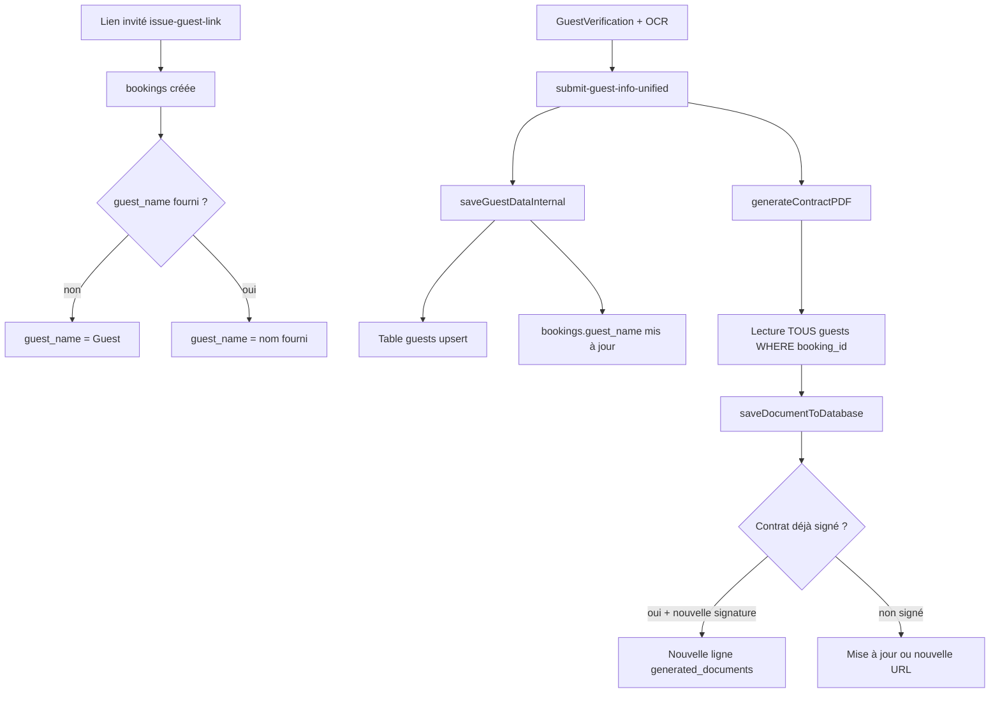

# Problème : conflits de noms et versions de contrats

> **Archive session (tokens, Saima/Sakara, Magno, commandes, liens) :** [ARCHIVE_RESOLUTION_TOKENS_CONTRATS.md](./ARCHIVE_RESOLUTION_TOKENS_CONTRATS.md)

Document de synthèse pour comprendre le dysfonctionnement observé (invités / hôtes qui voient de **mauvais noms**, d’**anciens contrats**, ou des données qui ne correspondent pas à leur séjour), et comment le résoudre de façon durable.

**Fichier d’audit SQL associé :** `supabase/sql/audit_contract_guest_names.sql`  
**Fonction principale :** `supabase/functions/submit-guest-info-unified/index.ts`  
**Page invité :** `src/pages/GuestVerification.tsx`

---

## 1. Symptômes rapportés

| Symptôme | Exemple typique |
|----------|-----------------|
| Nom affiché ≠ voyageur réel | Contrat ou écran avec « Guest », ou un autre prénom |
| Article « occupants » du PDF incorrect | Noms d’autres personnes, liste incomplète, voyageurs fantômes |
| Même invité, plusieurs contrats | 3 à 15 lignes dans `generated_documents` pour **un** `booking_id` |
| Ancienne URL encore valide | PDF non signé, ancien nom, ou état obsolète alors que la base a été corrigée |
| Confusion entre réservations | Rare : `guest_submissions` ou token lié au mauvais séjour |

---

## 2. Ce que l’on pensait vs ce que fait réellement le système

### 2.1 Intuition courante (partiellement vraie)

> « Il y a plusieurs contrats parce qu’on enregistre pour **plusieurs personnes**, selon l’**extraction du nom de la propriété** et la **période** choisie. »

**Vrai :**

- **Propriété + période (check-in / check-out)** → en principe **une réservation** (`bookings`) → **un dossier** pour ce séjour.
- Changer de logement ou de dates → souvent **un autre** `booking_id` → **un autre** contrat. C’est le comportement attendu.
- Les données du bien (nom, adresse, règles) et les dates alimentent le **contenu** du PDF via le contexte contrat (`buildContractContext` / template).

**Faux ou incomplet :**

- **Plusieurs voyageurs sur le même séjour** ne créent **pas** un contrat par personne.
- Le PDF est **unique par `booking_id`** : une boucle liste **tous** les invités de la table `guests` dans l’article occupants.
- **3 à 15 contrats pour une même résa** = en général **plusieurs versions** (soumissions, prévisualisations, signatures, erreurs, régénérations), **pas** 15 personnes.

### 2.2 Schéma simplifié du flux



---

## 3. Tables et rôles

| Table / champ | Rôle | Source de vérité pour le PDF ? |
|---------------|------|--------------------------------|
| `bookings.guest_name` | Nom « principal » affiché côté hôte / résumé | Partiel — en-tête / résumé, pas la liste complète des occupants |
| `guests` | Une ligne par voyageur (nom, pièce d’identité, etc.) | **Oui** pour l’article occupants du contrat |
| `guest_submissions` | Snapshot JSON de la soumission invité | Historique / reprise formulaire |
| `generated_documents` | URLs des PDF (contrat, fiche police) | **Ce que l’utilisateur voit** si l’UI ou le lien pointe vers cette ligne |
| `uploaded_documents` | Miroir partiel pour certains flux | Aligné avec contrat signé dans certains cas |

**Point critique :** même si `guests` est correct **aujourd’hui**, l’utilisateur peut ouvrir un **ancien** `document_url` dans `generated_documents` généré **avant** la correction des noms.

---

## 4. Causes racines identifiées

### 4.1 Placeholder `Guest` sur la réservation

À la création du lien (`issue-guest-link`) :

```ts
guest_name: reservationData.guestName || 'Guest'
```

Si le nom n’est pas fourni à l’émission du lien, `bookings.guest_name` reste **Guest** jusqu’à une soumission réussie qui appelle `saveGuestDataInternal` et met à jour le nom.

**Cas où le nom reste faux :**

- Soumission interrompue (erreur PDF, ex. `WinAnsi cannot encode "İ"`).
- Flux `host_direct` ou chemins qui ne passent pas par la même synchro.
- Backfill / migration SQL qui crée `guests` sans mettre à jour `guest_name`.

### 4.2 Contrat généré avant que les `guests` soient à jour

Ordre temporel important :

1. PDF généré et enregistré dans `generated_documents`.
2. Plus tard : lignes `guests` créées ou modifiées (OCR, backfill, nouvelle soumission).

L’audit section **N** marque cela `CONTRACT_BEFORE_GUEST_BACKFILL` : le **dernier** contrat en date peut être **antérieur** à `guests.created_at` → PDF figé avec anciens noms ou liste vide / placeholder.

**Batch du 13 avril 2026 (exemple audit) :**

- **12** réservations touchées au même `updated_at` sur `guests`.
- **9×** `CONTRACT_BEFORE_GUEST_BACKFILL`
- **3×** `CONTRACT_AFTER_GUEST_BACKFILL` (contrat régénéré après le backfill)
- **5×** `guest_name` = `Guest` (PLACEHOLDER) malgré un `guests.full_name` correct

### 4.3 Multiples versions de contrat (3 à 15 par résa)

Logique dans `saveDocumentToDatabase` (`submit-guest-info-unified`) :

| Situation | Comportement |
|-----------|--------------|
| Nouveau PDF non signé, pas de signé existant | Met à jour le contrat non signé le plus récent (souvent) |
| Nouveau PDF **signé** alors qu’un signé existe déjà | **Crée une nouvelle ligne** (version) — ne pas écraser le signé |
| Nouveau PDF non signé alors qu’un **signé** existe | **Refuse** de remplacer — retourne l’existant signé |
| Même URL | Pas de doublon |

Chaque **re-soumission**, **prévisualisation**, **correction après erreur**, ou **nouvelle signature** peut ajouter ou laisser coexister plusieurs URLs. Ce n’est **pas** équivalent à « un contrat par voyageur ».

### 4.4 Désynchronisation `guest_name` ≠ `guests.full_name`

Section **K** de l’audit : `NAME_MISMATCH` même quand `timing_flag` = ok.

Exemple type : `bookings.guest_name` = « Volkan » alors que `guests` = « Claire » → confusion UI / exports, même si le PDF récent lit bien `guests`.

Causes possibles : mauvaise réservation réutilisée, doublons `INDEPENDENT_BOOKING`, mise à jour partielle, pas de resync systématique après OCR.

### 4.5 Upsert partiel des `guests` (voyageurs fantômes)

`saveGuestDataInternal` met à jour les invités **présents dans la soumission** mais n’appelle pas forcément `sync_booking_guests` (contrairement au `BookingWizard` hôte). D’anciennes lignes `guests` peuvent rester et apparaître dans le PDF.

### 4.6 Ancienne URL conservée côté client

`GuestVerification.tsx` peut stocker `contractUrl` dans `localStorage`. Un lien partagé, un favori, ou un email peut pointer vers une **version N** alors que la version **N+5** est la bonne en base.

### 4.7 Doublons de réservation

Section **I** : plusieurs `bookings` pour le même bien + mêmes dates avec `booking_reference = 'INDEPENDENT_BOOKING'`. Risque de soumettre sur le mauvais `booking_id`.

---

## 5. Faux positifs : ce qui est normal

| Observation | Interprétation |ç


|-------------|----------------|
| Plusieurs `booking_id` pour des séjours différents | Normal — un contrat par séjour |
| Plusieurs lignes `guests`, un contrat | Normal — tous listés dans **un** PDF |
| Plusieurs contrats signés dans le temps | Normal si re-signature explicite — mais l’UI doit montrer **la bonne** version |
| Extraction OCR propriété / dates | Alimente le **prochain** PDF, ne justifie pas seul 15 fichiers sur **une** résa |

---

## 6. Outil d’audit SQL (sections A → O)

Fichier : `supabase/sql/audit_contract_guest_names.sql`

| Section | Objectif |
|---------|----------|
| **A** | Synthèse réservation / guests / soumission / dernier contrat |
| **B** | Plus de lignes `guests` que `number_of_guests` |
| **C** | `guest_name` ≠ noms dans `guests` |
| **D** | `guest_submissions.booking_id` vs dates du séjour |
| **E** | Token vs métadonnées nom |
| **F** | Versions contrat vs date MAJ `guests` (`timing_flag`) |
| **G–H** | Cibler un `booking_id` ou un nom |
| **I** | Doublons `INDEPENDENT_BOOKING` |
| **K** | **Critique** : PLACEHOLDER / MISMATCH noms |
| **L** | Batch même `updated_at` sur plusieurs guests |
| **M** | Détail réservations d’un batch (ex. 13/04/2026) |
| **N** | Contrat avant / après backfill guests |
| **O** | Aperçu UPDATE `Guest` → `guests.full_name` (à valider avant exécution) |

**Requête rapide — versions de contrat pour une résa :**

```sql
SELECT id, created_at, is_signed, left(document_url, 80) AS url_prefix
FROM public.generated_documents
WHERE booking_id = 'VOTRE_UUID'::uuid
  AND document_type = 'contract'
ORDER BY created_at DESC;
```

Comparer `count(*)` ici avec `count(*)` sur `guests` pour le même `booking_id`.

---

## 7. Correctifs déjà faits (code)

| Problème | Fichier / commit | Statut |
|----------|------------------|--------|
| Dates OCR non modifiables après scan | `GuestVerification.tsx`, `GuestHybridDateField.tsx` | Corrigé (commits sur `main`) |
| PDF : caractères Unicode (ex. İ turc) | `pdfUnicodeFonts.ts`, `submit-guest-info-unified` | Corrigé en code — **déployer** la Edge Function en prod |

---

## 8. Plan de résolution recommandé

### 8.1 Données (immédiat)

1. Exécuter section **K** (global) et **M/N** (batch 13/04).
2. Valider puis exécuter section **O** : aligner `bookings.guest_name` quand valeur = `Guest` mais `guests.full_name` est renseigné.
3. Étendre le même UPDATE aux autres réservations `PLACEHOLDER` hors batch.
4. Lister les résas `CONTRACT_BEFORE_GUEST_BACKFILL` → **régénérer** le contrat (ou déclencher une nouvelle soumission hôte) pour figer le PDF avec les `guests` actuels.
5. Contrats **déjà signés** : nouvelle version + processus de re-signature si le texte légal doit changer (ne pas écraser silencieusement un signé).

### 8.2 Produit / UX

1. **Toujours** charger le contrat avec `ORDER BY created_at DESC` (ou dernier signé si politique métier = « le signé fait foi »).
2. Ne plus exposer d’anciennes URLs dans l’UI, emails, ou `localStorage` sans invalidation.
3. Afficher clairement : « Contrat du JJ/MM/AAAA » + état signé / brouillon.
4. Après soumission réussie, invalider les anciens liens ou rediriger vers la dernière version.

### 8.3 Code (prévention)

1. **`issue-guest-link`** : éviter `Guest` par défaut ; exiger un nom ou libellé « À compléter par l’invité » synchronisé dès la première soumission.
2. **`saveGuestDataInternal`** : toujours synchroniser `bookings.guest_name` depuis le voyageur principal après OCR / soumission.
3. **`sync_booking_guests`** (ou équivalent) dans le flux invité pour supprimer les voyageurs retirés du formulaire.
4. **Génération PDF** : après écriture complète de `guests`, pas avant (ou régénération automatique si `guests` changent après coup).
5. Monitoring : RPC `admin_get_discrepant_bookings` (migration `20260507000003`) si déployée.

### 8.4 Déploiement prod

```bash
supabase functions deploy submit-guest-info-unified
```

Sans ce déploiement, les soumissions avec caractères spéciaux peuvent encore échouer **avant** mise à jour des noms et du contrat.

---

## 9. Arbre de décision pour une réservation signalée

```
Réclamation invité sur le nom / contrat
        │
        ├─ Mauvais booking ? → Section I, H (même nom sur autre séjour ?)
        │
        ├─ guest_name = Guest mais guests OK ? → Section O, sync guest_name
        │
        ├─ guests OK mais PDF faux ? → Section N/F : ancienne version ?
        │       ├─ Oui → Régénérer + pointer UI vers dernier created_at
        │       └─ Non → Lire guests au moment generateContractPDF (bug flux)
        │
        ├─ Trop de lignes guests ? → Upsert partiel / fantômes
        │
        └─ 15 contrats, 2 guests ? → Versioning normal ; corriger le lien affiché
```

---

## 10. Fichiers clés du codebase

| Fichier | Rôle |
|---------|------|
| `supabase/functions/issue-guest-link/index.ts` | Création réservation, placeholder `Guest` |
| `supabase/functions/submit-guest-info-unified/index.ts` | Sauvegarde invités, génération PDF, versioning documents |
| `supabase/functions/_shared/pdfUnicodeFonts.ts` | Polices Unicode PDF |
| `src/pages/GuestVerification.tsx` | Formulaire invité, OCR, erreurs, `contractUrl` |
| `supabase/sql/audit_contract_guest_names.sql` | Requêtes d’audit et correctifs données |
| `supabase/migrations/20260507000003_admin_reconciliation_rpcs.sql` | RPC admin réconciliation (si appliquée) |

---

## 11. Résumé en une phrase

Le problème n’est en général **pas** « un contrat par personne ou par extraction propriété », mais **désynchronisation** entre `bookings.guest_name`, table `guests`, et **plusieurs snapshots PDF** (`generated_documents`), combinée au placeholder **Guest** et à des contrats générés **avant** que les invités soient correctement enregistrés — d’où l’impression de « conflit » quand une **ancienne URL** est ouverte.

---

## 12. Prochaines actions suggérées (checklist)

- [ ] Déployer `submit-guest-info-unified` en production
- [ ] Exécuter audit sections K, N, O sur l’environnement concerné
- [ ] Corriger `guest_name` PLACEHOLDER validés en aperçu
- [ ] Régénérer les 9+ résas `CONTRACT_BEFORE_GUEST_BACKFILL` du batch 13/04
- [ ] Décider règle métier : **dernier contrat** vs **dernier signé** pour l’affichage
- [ ] Implémenter prévention code (sync guests, pas de PDF avant guests, UI dernière version)
- [ ] Documenter pour le support : « plusieurs PDF = versions, pas plusieurs voyageurs séparés »

---

## 13. Cas d’étude : Magno — La pépite de Gauthier (mai vs juillet)

**Booking ID :** `29168681-a9db-400d-b2ea-ca8f7ae7fa1d`  
**Propriété :** `e9014f29-d8dd-45ce-adbb-d0497a13987f` — La pépite de Gauthier · Appartement d'Architecte  
**Investigation :** requêtes directes Supabase (mai 2026) — le serveur MCP `supabase-mcp` n’est pas branché dans Cursor ; script `tools/investigate-magno.mjs`.

### 13.1 Faits établis en base

| Élément | Valeur |
|--------|--------|
| `bookings` créée le | **2026-04-05** 11:10 UTC |
| Dates enregistrées **depuis l’origine** | **2026-05-13 → 2026-05-15** (2 nuits, 3 clients) |
| Famille Magno dans `guests` | JANSEN GERALD, FRANCES JASMINE, JOANNE MARIE (créés le 05/04) |
| Contrat signé le | **05/04/2026** (première version, puis régénérations jusqu’au 20/05) |
| `guest_submissions` pour ce booking | **1 seule** (20/05/2026) avec dates mai + 3 noms Magno |
| Séjour juillet **10–12/07** pour Magno | **Aucune ligne** (ni booking, ni guest, ni submission) |
| Autres juillet sur ce bien | ISABEL TORRES (06–10/07), THOMAS NIMEN (25–27/07), etc. — pas Magno |

**Conclusion dates :** le système n’a **jamais** enregistré juillet pour Magno. Si le séjour réel Airbnb est en juillet, l’écart vient d’une **saisie initiale incorrecte le 5 avril** (lien / formulaire / calendrier hôte), pas d’une corruption en mai. Magno a soumis ce qu’il voyait (**mai**), cohérent avec `booking_data` de la submission du 20/05.

### 13.2 Les 11 tokens sur le même `booking_id`

Entre **21/04** et **20/05**, **11** lignes `property_verification_tokens` pointent vers `29168681…` :

| Date | Nom dans metadata | Dates metadata | Note |
|------|-------------------|----------------|------|
| 21/04 | — | 13–15/05 | `ics_direct` |
| 29/04 | — | **08–17/09** | metadata `bookingId` = `9b6dc1ea…` (**booking introuvable**) ; colonne `booking_id` = Magno |
| 02/05 | — | *(vide)* | Token **`aee301ed`** — voir §13.3 |
| 07/05 | — | 13–15/05 | |
| 07/05 | — | *(vide)* | |
| 13/05 ×4 | **Guest** | 13–15/05 | Liens émis sans nom (placeholder) |
| 14/05 | **Yacine Farhn Adam** | 13–15/05 | Autre personne, **même** `booking_id` |
| 20/05 | — | 13–15/05 | |

Ce n’est **pas** « un token par voyageur Magno », mais **réémissions répétées** de liens hôte rattachés à la **même** réservation mai.

### 13.3 Token « générique » réutilisé (`aee301ed`)

Un seul token (`2026-05-02`, `metadata.reservationData` **null**) apparaît dans **8** `guest_submissions` pour **8 `booking_id` différents** (FLORENCE, ISABEL, JAVIER, BEN YAKHLEF, etc.) — dont Magno le 20/05.

**Bug produit :** un lien propriété peut servir de **bus partagé** : chaque soumission crée ou met à jour une réservation, mais garde le même `token_id`. Cela mélange l’historique et peut fausser les stats / le débogage (pic OCR OpenAI autour du **19/05** corrélé aux multiples essais + tokens « Guest »).

### 13.4 Mécanismes code en cause

1. **`issue-guest-link`** sans `bookingId` : cherche la réservation « active » la plus proche pour la propriété (`check_out >= aujourd’hui`, `order check_in asc limit 1`) → peut rattacher un nouveau lien à la résa **Magno mai** même pour un autre séjour.
2. **`issue-guest-link`** avec `bookingId` : **met à jour** `check_in/out` sur la réservation ciblée — risque d’écraser des dates si l’hôte choisit mal (ex. septembre dans metadata du 29/04).
3. **`submit-guest-info-unified` / `resolveBookingInternal`** : si le token contient un `bookingId`, les dates viennent de **`bookings`**, pas du formulaire invité — l’invité ne peut pas « corriger » vers juillet tant que le token pointe vers `29168681`.
4. **Pas de contrainte** « un token actif = un seul `booking_id` » ni invalidation des anciens tokens à la réémission.

### 13.5 Que faire pour Magno (données)

1. **Confirmer métier** : séjour réel = juillet 10–12 ?
2. Si oui : **créer une nouvelle réservation** `INDEPENDENT_BOOKING` avec les bonnes dates (ou corriger si contrainte unique le permet), **nouveau lien** avec `bookingId` explicite, **désactiver** les 11 anciens tokens (`is_active = false`).
3. Ne pas réutiliser `29168681` pour d’autres noms (Yacine / Guest) — ce sont des erreurs de rattachement hôte.
4. Régénérer contrat / fiche police sur le **nouveau** `booking_id` après soumission complète.

### 13.6 Correctifs produit recommandés

- À l’émission du lien : **obliger** `bookingId` + dates affichées = dates du booking ciblé ; bloquer si mismatch.
- **Ne plus** réutiliser automatiquement la « prochaine résa » de la propriété sans `bookingId`.
- **Un token = un séjour** (ou invalider l’ancien à chaque `issue`).
- UI hôte : afficher en gros « Ce lien est pour : **Magno, 13–15 mai** » avant envoi.
- Audit : `SELECT booking_id, count(*) FROM property_verification_tokens GROUP BY booking_id HAVING count(*) > 3`.

---

## 14. Solution générale (pas seulement Magno)

### 14.1 Pourquoi les noms « se perdent »

| Étape | Source de vérité | Cause de perte |
|-------|------------------|----------------|
| Émission lien | `reservationData` dans le token | Mauvaise résa rattachée ; dates metadata ≠ booking |
| Formulaire invité | React `guests[].fullName` | Prérempli depuis token / résa obsolète |
| Sauvegarde | Table `guests` | `guest_submissions.token_id` incorrect (premier token propriété) — **corrigé** |
| Contrat PDF | `guests` au moment de `generateContract` | PDF ancien ou généré avant MAJ guests |
| Fiche police | `generated_documents` (`Police_{nom}.pdf`) | Fichiers legacy `police-{bookingId}-….pdf` |

**Chaîne correcte :** 1 token actif / séjour → soumission avec bon `token_id` → `guests` → sync `bookings.guest_name` → régénération contrat + police → UI = **dernier** document.

### 14.2 Correctifs code (branche actuelle)

- **`issue-guest-link`** : plus de « prochaine résa » ; INDEPENDENT par bien+dates ; pas d’écrasement dates si mismatch ; désactivation anciens tokens du même `booking_id`.
- **`submit-guest-info-unified`** : `token_id` = token de la requête (ou du booking), pas de la propriété.

### 14.3 Magno — état

- **Juillet 10–12** : introuvable en base ; séjour **13–15 mai** depuis le **5 avril**.
- **11 tokens** désactivés (`fix_magno_tokens_and_july_stay.sql` section A).
- Si séjour réel = juillet : décommenter section B du SQL, puis **nouveau lien** depuis l’app.

### 14.4 Outils

- `tools/audit-name-consistency.mjs`
- `supabase/sql/audit_contract_guest_names.sql`

### 14.5 Déploiement

```bash
supabase functions deploy issue-guest-link
supabase functions deploy submit-guest-info-unified
```

---

## 15. Magno juillet + conflits de dates (mai 2026)

### 15.1 Magno — séjour juillet créé

| Champ | Valeur |
|--------|--------|
| **booking_id** | `3d38c126-9c3f-416d-8d4d-2cc040ff05dd` |
| Dates | **10–12 juillet 2026** |
| Invités | JANSEN GERALD, FRANCES JASMINE, JOANNE MARIE MAGNO |
| Contrat + police | générés en base |

Émettre un **nouveau lien invité** depuis l’app sur ce `booking_id` juillet.

### 15.2 Cas Samia / Sakara

- Aucun « Samia » ni « Sakara » en base.
- Proche : **SAUNA RAB** — résa `e6113444…`, **23–28 mai** (7ème ciel).
- **21–23 mai** La pépite : `c726ac61…` — **THOMAS SKOWRON**.

### 15.3 Blocages identifiés (analyse de masse)

1. Tokens partagés (`73a33917`, `aee301ed`) → plusieurs `booking_id`.
2. `ics_direct` + `booking_id` token ignorait les dates du formulaire → **corrigé** dans `submit-guest-info-unified`.
3. `issue-guest-link` rattachait la prochaine résa → **corrigé**.

Audit : `supabase/sql/fix_date_conflicts_audit.sql`, `tools/audit-date-conflicts.mjs`

---

*Document généré pour capitaliser la discussion d’audit contrats / noms invités — Morocco Host Helper.*
